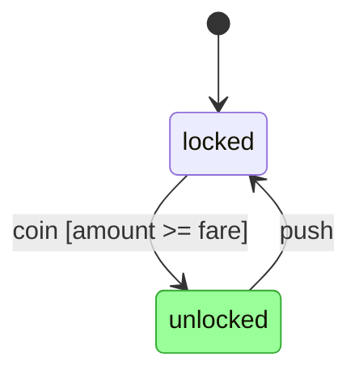

# Determa State — specification

Status: **draft**. Covers grammar format 1 and format `2-alpha1`; normative unless a
section says "informative."
Spec version: **0.0.6** (see `VERSION`; synchronized across the Determa State repos).
Keywords MUST / SHOULD / MAY per RFC 2119.

## 0. References

- Miro Samek, *Practical Statecharts in C/C++ — Quantum Programming for Embedded
  Systems* (PSiCC). The canonical hierarchical-state-machine (HSM) dispatch and
  transition algorithm. **Implementers SHOULD follow PSiCC's RTC/LCA algorithm.**
  The outermost state is named **`top`** after PSiCC.
- David Harel, *Statecharts: A Visual Formalism for Complex Systems* (orthogonal
  regions, hierarchy, history).
- UML 2.x State Machines (terminology; behavioral semantics where not overridden).
- CEL — Google Common Expression Language (<https://cel.dev/>), the guard /
  expression language (§6).
- `cns_statemachine` (prior art: a Ruby HSM with a YAML machine format). Determa State keeps
  its vocabulary — `top`, `esvs`, `on_events`, `transition_to`, `defer`, `publish`,
  `event_types` — and replaces raw Ruby guards/actions with CEL + structured actions.

## 1. Goals

1. **One definition, many runtimes.** A machine is defined once in YAML; an engine in
   any language runs it. Cross-language agreement is guaranteed by the conformance
   suite (§9), the ultimate arbiter of correct behavior.
2. **Full statechart semantics:** hierarchy, orthogonal regions, history, defer,
   timers, run-to-completion.
3. **Active objects:** each instance owns an event queue; instances are spawned
   dynamically and communicate only by publishing events (no shared mutable state).
4. **Portable, sandboxed expressions:** guards in CEL; actions are a small structured
   set whose computed values are CEL. Host scripting languages are pluggable.
5. **Extended state done right:** typed variables (`esvs`) declared **inside states**,
   hierarchically scoped — not a global blob. External values are esvs too (§4.4).
6. **Robust over time:** defined faults (§5.10), external-change handling (§5.4),
   versioned definitions + safe-point migration (§10).
7. **Pluggable infrastructure:** the event bus, queue, clock, and store are adapters
   with a simple in-memory default for tests (§8); machine semantics don't depend on
   the transport.
8. **Contracts:** declare and statically check that a machine provides an interface (§7).
9. **Application-agnostic engine.** No domain concepts.

## 2. Conformance

An implementation is **conformant** iff it passes every case in the conformance suite
(§9), which lives in its own repository — **[`fruwehq/determa-state-conformance`](https://github.com/fruwehq/determa-state-conformance)**
(this repo holds only the normative text: `SPEC.md`, `schema/`, `examples/`).
Where prose and the suite disagree, the suite wins and a bug MUST be filed against
this document. Implementations MAY add guard/action languages and adapters; they MUST
NOT change core dispatch semantics. Machine YAML MUST validate against
`schema/machine.schema.json` before execution.

**Parsing.** Determa State YAML MUST be parsed under the **YAML 1.2 core schema** (only
`true`/`false` are booleans). Identifiers (state/event/variable names) MUST match
`^[A-Za-z_][A-Za-z0-9_]*$`. The names `top`, `id`, `parent`, `event`, and the events
`initial`, `entry`, `exit`, `env`, `error`, `done` are **reserved** (§3, §5).

**Library API.** An implementation MUST expose a programmatic API usable as a
**library** — a host program can drive the engine **without** invoking the CLI (§13) or
touching the file-backed store. The surface is **language-idiomatic** (not standardized
across languages), but MUST at minimum let a host: load and validate a definition;
register definitions and create a root instance with a given `id` and `external` esvs;
deliver a typed event and run to quiescence (§5.7); advance the virtual clock (§5.9);
read an instance's status, active configuration, and esvs; and snapshot/restore an
instance (§8). In addition to serialized text (YAML/JSON), the API SHOULD also let a
host construct a definition from a **native mapping** (a host-language dict/map/value)
through the same validation path, so machines can be built in code without serializing.
The CLI is a thin wrapper over this API; cross-language behavioral parity is pinned by
the conformance suite (§9), not by the API's shape.

**Static validation.** Beyond the schema and reserved names, a definition is **rejected
at load** if either check below fails. Both are **conservative** and **guard-agnostic**
(guards are treated as possibly-true), so a rejection always indicates a genuine
structural defect:
- **Unreachable states.** Every declared state other than `top` MUST be reachable.
  Starting from `top` and its `initial`, a state becomes reachable when it is the
  `initial`/region-initial target of a reachable composite/orthogonal state, or a
  `transition_to` target (from `on_events`, `after`, or a `choice` branch) of a reachable
  state — together with the ancestors such entry implies and the initial descendants it
  triggers. A state nothing can reach is an error.
- **Dead branches.** In a guarded transition list (§4.5) or a `choice` (§5.5.1), a branch
  with no `guard` is the unconditional default and MUST be **last**; any branch after it
  can never be selected (first passing guard wins) and is an error.

## 3. Concepts

- **Machine definition** — a YAML document describing one *kind* of statechart, with a
  single outermost state, `top`.
- **Machine instance** (a.k.a. **active object**) — a running statechart: a definition
  + **extended state** (`esvs`, §4.4) + an **event queue** + a **deferred set** (§5.8)
  + a **state configuration** (active states; >1 with orthogonal regions). Has a
  stable **instance id** (`id`) and a **parent** id, and records the **definition
  version** it runs under. State is per-instance; instances never share variables.
- **State** — `simple` (leaf), `composite` (one region of substates), `orthogonal`
  (≥2 regions), or `final`. `top` is the outermost composite/orthogonal state.
- **Region** — an independent area of a composite/orthogonal state with its own active
  substate. Orthogonal regions run within one RTC step of the *same* instance
  (synchronous), unlike spawned instances (asynchronous).
- **Submachine state** — a state that inlines another definition synchronously (§5.6.1),
  the run-to-completion counterpart of a spawned active object; it has an isolated esv
  scope and completes to the parent via `done`.
- **Pseudostates** — the **initial transition** of a composite/region, `final`,
  `history` (shallow/deep), and the **choice** pseudostate (§5.5.1). *Static* conditional
  branching is expressed by **guarded transition lists** (§4.5, first passing guard wins,
  the UML *junction*); *dynamic* branching — compute a value, then branch on it within one
  step — uses a **choice** pseudostate.
- **Event** — an occurrence of a declared **event type** carrying a typed payload.
  Some event types are **reserved lifecycle events**: `initial`, `entry`, `exit`
  (state lifecycle, §5.3/§5.5), `env` (external change, §5.4), `error` (fault, §5.10),
  `done` (orthogonal completion, §5.6).
- **Transition** — `source --event [guard] / action--> transition_to`. Kinds:
  **external** (default), **internal** (no exit/entry; action only), **local**. May be
  guarded.
- **esv** — an extended-state variable (typed; declared in a state; §4.4).
- **Contract** — a named interface (required events, states, spawns; §7).

## 4. Machine definition (YAML)

The `schema/machine.schema.json` JSON Schema is normative for structure; this section
gives meaning. See `examples/full.yaml` (every feature) and `examples/minimal.yaml`.

```yaml
format: 1                  # grammar version (optional; defaults to 1)
id: download               # definition id (required, stable)
version: 1                 # this definition's version, for migration (optional; default 1)
contracts: [download]      # interfaces this machine claims to satisfy (§7)
subscribe: []              # external event types this machine listens for (§5.7)

events:                    # event-type declarations (the alphabet) (§4.3)
  connected: {}
  chunk:  { payload: { bytes: { type: int, required: true } }, scope: internal }
  download_done: { payload: { id: { type: string } }, scope: local }

top:                       # THE outermost state (PSiCC "top"); holds machine-wide
  esvs:                    #   esvs, listeners, and the initial transition (§4.4)
    password: { type: string, external: true }   # seeded by host; read-only; retained
    bytes:    { type: int, init: 0 }
  on_events:
    env:   { guard: "event.payload.changed.password != password", transition_to: reprovision }
    error: { transition_to: failed }             # fault handling is just a listener
  initial: { transition_to: idle }               # an initial *transition* (§5.3)
  states:
    idle:
      on_events:
        connected: { transition_to: idle }
    reprovision:
      entry:
        - refresh: { only: [password] }          # adopt the changed external value
    failed: {}
```

### 4.1 Top-level fields
- `format` (int, optional, default `1`) — grammar version the engine parses against.
- `id` (string, required, stable) — definition id.
- `version` (int ≥1, optional, default `1`) — *this definition's* version, bumped by
  the author; input to migration (§10). `format` versions the language; `version`
  versions the machine.
- `contracts` (list, optional) — declared interfaces (§7).
- `subscribe` (list of event-type names, optional) — external events this machine
  receives by subscription (§5.7).
- `events` (map, optional but RECOMMENDED) — typed event types (§4.3). If present, only
  declared events MAY be delivered and payloads MUST validate.
- `languages` (map, optional) — `{guard, action}` ids; defaults `{guard: cel, action:
  determa}`.
- `meta` (map, optional) — opaque machine-level annotations for host layers. The engine
  ignores this data (§4.5).
- `migrations` (list, optional) — forward migrations from older versions (§10).
- `top` (StateNode, required) — the outermost state (§4.5). All behavior lives under it.

### 4.2 No global blob
There is **no** top-level `data`/`params`/`context`. Machine-wide *mutable* state is
declared as `esvs` on `top` (§4.4). Machine-wide *external/immutable-ish* inputs are
`external` esvs (also on `top`). Object identity is the intrinsic `id`/`parent`.

### 4.3 Events (typed payloads, scope)
`events: { name: { payload?: { field: {type, required?, default?} }, scope? } }`.
- `payload` fields are typed; `required: true` MUST be present; extras are rejected.
  Validation happens at delivery; an invalid payload is a host error (not enqueued).
- `scope ∈ {internal, local, global}` (default `internal`) governs **undirected**
  delivery (§5.7): `internal` = self only; `local` = the publishing instance's tree;
  `global` = the whole bus. **Directed** publishes (`to:`) ignore scope. Per "make the
  default explicit," authors SHOULD write `scope` when an event crosses instances.
- Reserved lifecycle events (`initial`/`entry`/`exit`/`env`/`error`/`done`) are not
  declared here.

### 4.4 Extended-state variables (`esvs`)
`esvs` are Harel/Samek *extended state* — declared **inside states**, never globally.
A state (including `top`) MAY carry an `esvs` block:

`esvs: { name: { type, init?, external? } }`.
- `type ∈ {string, int, float, bool, map, list}`.
- `init` — initial **literal** value, assigned **on entry** to the declaring state
  (§5.1). Omit ⇒ starts unset (`null`). A non-null `init` MUST match `type`. (Dynamic
  initialization is done with an `entry` action.)
- `external: true` — the value is **seeded from the host** at entry (resolved settings/
  secrets/environment), is **read-only** to `assign`, and **retains** its value until
  re-seeded (state re-entry) or adopted via `refresh` (§5.4). External esvs are how a
  machine *owns* a copy of an outside value (e.g. a provisioned password).

**Scope.** A variable is visible to its declaring state, that state's substates, and
their guards/actions/timers. Resolution walks **up** the active hierarchy; an inner
declaration **shadows** an outer one. `top`'s esvs are in scope everywhere. Lifetime,
re-init, and write rules: §5.1.

### 4.5 StateNode
- `type`: `simple` (default) | `composite` | `orthogonal` | `final`.
- `meta`: opaque state annotations for host layers (guardrails, UIs, routing, etc.).
  `meta` MUST be a map if present. It is purely informative and has no effect on
  dispatch, validation, snapshots, or conformance behavior.
- `esvs`: variables scoped to this state (§4.4).
- `entry`, `exit`: ordered action lists run on entry/exit (§6).
- `initial`: the **initial transition** (`{ transition_to, guard?, action? }`),
  required for `composite`; each `orthogonal` region declares its own. Taken on entry
  to reach a substate; MAY run an action (§5.3).
- `states`: nested states (for `composite`).
- `regions`: list of `{ initial, states }` (for `orthogonal`, ≥2, ordered §5.6).
- `on_events`: map `event -> Transition | [Transition,...]` (a list is ordered; first
  passing guard wins). Listeners — including `env`/`error` — live here.
- `after`: list of `{ duration, transition_to?, action?, guard? }` timers (§5.9).
- `defer`: event names deferred while this state is active (§5.8).
- `history`: `none` (default) | `shallow` | `deep`.
- `choice`: an ordered **branch list** (§5.5.1). Declaring it makes the node a **choice
  pseudostate**; it is then mutually exclusive with the state fields above (no `esvs`,
  `entry`, `exit`, `states`, `on_events`, …).
- `submachine`: the **id of another definition** to inline **synchronously** (§5.6.1).
  Declaring it makes the node a **submachine state**, mutually exclusive with `states`,
  `regions`, and `choice`. Optional `with: { <externalEsv>: <CEL> }` seeds the referenced
  machine's `external` esvs from the parent scope on entry. The referencing state MAY
  still declare `entry`/`exit`/`on_events`/`after` (its own, layered above the submachine).

### 4.6 Transition
- `transition_to`: target state id, dotted for nesting; omit ⇒ internal. MAY name a
  **choice pseudostate** (§5.5.1), which resolves to a real state within the step.
- `guard`: CEL boolean (optional). `lang:` MAY override the language.
- `action`: ordered action list (optional).
- `internal` / `local`: bool (§5.5).

## 5. Execution semantics (normative)

### 5.1 Extended state (lifetime, scope, writes)
- **Initialization.** A state's `esvs` are created and assigned their `init` (or `null`)
  **when the state is entered**, *before* its `entry` actions. `external` esvs are
  seeded from the host at that point. They are **destroyed on exit** (after `exit`
  actions). Re-entry **re-initializes** (history restores the *configuration*, not
  variable values). `top`'s esvs initialize once, at instance creation.
- **Reads.** A name resolves up the active hierarchy, innermost first (shadowing).
  Referencing a name not in scope is a load-time error.
- **Writes.** `assign` writes the **nearest enclosing** declaration. `external` esvs are
  read-only to `assign` (adopt changes via `refresh`, §5.4). Type-checked.
- **Canonical values.** A value produced by a guard/action language (e.g. a CEL
  expression result) MUST be **coerced to the variable's declared `type` and stored as a
  canonical native/JSON value**. An implementation MUST NOT surface an engine- or
  guard-language-internal wrapper type across any boundary — library return, snapshot
  (§8), CLI `--json` (§13.4), or observer (§8) — so every implementation exposes the
  same value representation.

### 5.2 Run-to-completion (RTC)
Each instance processes **one event completely** — all transitions, exit/entry/initial
actions, orthogonal dispatch — before dequeuing the next. No re-entrancy mid-step.
Events produced during a step are enqueued (§5.7), never recursed. RTC is
single-threaded per instance.

### 5.3 Entry, exit, and the initial transition
On entering a state: initialize its `esvs` (§5.1) → run `entry` actions → if
composite/orthogonal, take its `initial` transition(s) (running any initial `action`)
to reach substates. On exiting: run `exit` actions → destroy its `esvs`. `entry`,
`exit`, and `initial` are the **state lifecycle** (the cns `SIG_STATE_ENTRY` /
`SIG_INITIAL_STATE` analogues); ordering MUST match PSiCC and is pinned by the suite.

### 5.4 External change (`env`) and `refresh`
External esvs (§4.4) are seeded once and then owned by the machine. When the host
observes that an external source changed, it **posts the reserved `env` event** to the
instance with `payload.changed = { name: newValue, ... }`. The host monitors; the
machine reacts. A machine handles `env` in `on_events` like any event (compare its
current esv to `event.payload.changed.<name>`, guard, transition). The **`refresh`**
action (§6) adopts changes into the in-scope external esvs: `refresh: {}` copies all
names present in `event.payload.changed`; `refresh: { only: [a,b] }` copies a subset.
`refresh` is valid only while handling an `env` event.

### 5.5 Transition execution
For an external transition `src --> tgt` with actions `a`:
1. **LCA** = least common ancestor composite of `src` and `tgt`.
2. **Exit** from the current leaf up to (not including) LCA, innermost-first; per state
   run `exit` then destroy `esvs`.
3. Run transition actions `a`.
4. **Enter** from LCA down to `tgt`, outermost-first; per state initialize `esvs` then
   run `entry`; take `initial` transitions as needed (§5.3).
`internal`: actions only; no exit/entry. `local`: LCA is the containing composite
itself (no exit/re-entry of it). Ordering pinned by the suite.

### 5.5.1 Choice pseudostates (dynamic branching)
A node with a `choice` field is a **choice pseudostate**: a transient branch point that is
resolved *within* a transition and is **never part of the active configuration** — it has
no `esvs`, `entry`, `exit`, or `history`. `choice` is an ordered list of **branches**
`{ guard?, transition_to, action? }`. Exactly **one** branch MUST be the **default** (no
`guard`) and MUST be last; it is the `else`.

When a transition — or an `initial`, an `after`, or another branch — has `transition_to` a
choice `C`, the transition is a **compound transition** resolved before any exit/entry:
1. The triggering transition's `action` runs (in the **source** scope).
2. At `C`, branches are tried **in order**; the first whose `guard` passes — or the default
   — is selected, and its `action` runs. If the selected `transition_to` is another choice,
   repeat; otherwise it is the **final target** `tgt`.
3. The transition then executes as an external transition `src --> tgt` (§5.5): exit from
   the source leaf up to `LCA(src, tgt)`, then enter down to `tgt`. The choice(s) traversed
   contribute **no** exit or entry.

Branch guards and actions read/write esvs in the **source** scope (so a branch sees values
just assigned by the triggering transition — this is what makes it *dynamic*, unlike a
guarded transition list whose guards are evaluated before its action). The entire
resolution is one atomic RTC step: a fault anywhere rolls the whole step back (§5.10).

**Static validation** (load time): every choice has exactly one default branch; every
`transition_to` resolves; and the graph of choices reachable through `transition_to` is
**acyclic** (no choice can reach itself), so resolution always terminates at a real state.

### 5.6 Hierarchy & orthogonal regions
On dispatch of event `e`, search from the most deeply nested active state up the parent
chain; the first state with a transition for `e` whose guard passes handles it;
ancestors aren't consulted further for that region. If `e` is deferred by the active
config and unhandled, it is deferred (§5.8); otherwise unhandled events are discarded
(hosts MAY log). An `orthogonal` state offers `e` to **every** region in **declared
order** within one RTC step; the configuration is the union. When **all** regions reach
`final`, the engine generates a `done` event for the orthogonal state's parent.

### 5.6.1 Submachine states
A state with a `submachine: <def_id>` field **inlines another definition** as a nested
subtree, run **synchronously within the same instance and RTC step** — the
run-to-completion sibling of `spawn` (§5.7, which creates a separate async instance).

- **Entry.** Entering a submachine state instantiates the referenced definition's `top`
  as the state's child and performs its initial descent (§5.3): its esvs initialize, its
  `entry` actions run, and its `initial` transition is taken. The submachine has an
  **isolated esv scope** — the parent's esvs are **not** visible inside it; only the
  `external` esvs named in `with:` are seeded (each from a CEL expression over the parent
  scope), exactly as `spawn`'s payload seeds a child (§5.7).
- **Dispatch.** Events bubble by ordinary hierarchy (§5.6): the submachine's active
  states are offered the event first, then the referencing state's own `on_events`, then
  its ancestors — so a parent MAY handle (and thereby interrupt) events the submachine
  does not.
- **Completion.** When the submachine's `top` reaches `final`, the engine generates a
  **`done`** event for the referencing state (as orthogonal completion does); the parent
  typically transitions out of the submachine state on `done`. Results flow out via
  `publish` or the `done` payload — never through shared esvs.
- **Exit.** Exiting the referencing state exits the whole submachine subtree (its `exit`
  actions run, its esvs are destroyed), like any composite. Snapshots (§8), history
  (§5.3), and faults (§5.10) apply to the inlined subtree as to any other states.

**Static validation** (load time): the referenced definition MUST exist, and submachine
references MUST be **acyclic** (no definition inlines itself, directly or transitively).

### 5.7 Active objects, queues, spawning, the bus
- Each instance has a **FIFO queue**; `dispatch` = dequeue one event, run one RTC step.
  There is **no periodic tick**; the only driver is event arrival (timers included).
- **Tree.** The root is created by the host; others are **spawned** by an action:
  `spawn(def, payload?) -> id`. A child runs independently with its own queue. The
  spawner gets the child id (via `result:` into an esv). A spawned instance's `external`
  esvs MAY be seeded from the spawn payload by name. **Ids are deterministic:** the root
  id is supplied by the host/CLI (`new <id>`), and a spawned child's id is derived from
  its parent's id and a per-parent monotonic spawn counter (e.g. `parent/1`), so every
  engine allocates identical ids and any instance is addressable in conformance and the
  CLI.
- **Publishing.** `publish` hands an event to the **bus** (§8):
  - **Directed** — `to:` resolves (CEL) to an instance id or list (e.g. `parent`, `id`,
    a stored child id); delivered to exactly those instances, **ignoring scope**.
  - **Undirected** — delivered to instances that `subscribe` to the event type and lie
    within the event's `scope` (`internal`=self, `local`=this instance tree,
    `global`=bus). An instance always receives its own `internal` publishes.
  Delivery is asynchronous (enqueue for the target's next dispatch), per-pair FIFO.
- **Termination.** An instance whose `top` reaches `final`, or that runs `stop`,
  terminates: children stop first (post-order), `exit` actions run up the tree, and a
  `done` event is delivered to the parent.

> A manager-of-many (see `examples/full.yaml`) without breaking "one machine = one
> state": a `downloads` instance spawns a `download` per file; each is its own machine;
> a finished `download` does `publish { event: download_done, to: parent }`.

### 5.8 Deferred events
A state MAY list events in `defer`. UML **deferred-set** semantics (not a tail
re-queue): an unhandled event whose type is in the active config's effective defer set
moves to the instance's **deferred set** (order preserved). **Edge-triggered:** when an
RTC step changes the configuration, every deferred event no longer deferred is moved,
in order, to the **front** of the queue. (An instance's state changes only by
processing its own events, so re-checking on state change suffices — no poll, no
busy-loop.) The deferred set is part of the snapshot (§8).

### 5.9 Timers (clock via adapter)
Time comes from an injected **clock adapter** (§8), keeping the engine pure and tests
deterministic. A state's `after: [{ duration, transition_to?, action?, guard? }]`
schedules, on entry, a timer; on fire the engine enqueues an internal time event,
dispatched as an ordinary guarded transition. Exiting the state cancels its timers. In
conformance tests a **virtual clock** is advanced explicitly (`advance:`); no wall-clock
time is used. Outstanding timers are part of the snapshot.

### 5.10 Action faults
An RTC step (exit → transition → entry actions) is **atomic**. If an action raises, the
engine **aborts the step** (no partial transition; the triggering event goes to a
**dead-letter**) and **faults** the instance. If a state in scope handles the reserved
**`error`** event in `on_events`, the engine delivers `error` (payload carries the
fault) and dispatches it as a normal transition; otherwise the instance enters
**`__faulted__`** and stops dispatching until a host `reset`. Faulting is per active
object. **Hangs:** CEL + structured actions are total and bounded (no loops/IO) and
cannot hang; pluggable host languages get a clock-adapter **deadline** (overrun ⇒
fault). Faults/dead-letters/status are observable (§8).

## 6. Guard & action languages

**Guards = CEL** over the in-scope `esvs` plus `event` (`event.payload.*`) and the
intrinsics `id`/`parent`. CEL is side-effect-free, non-Turing-complete, and has
multi-language runtimes — that is what makes guards portable. Engines MUST provide CEL
and MAY provide host languages via `lang:` / `languages.guard`.

**Actions = a structured set (id `determa`)**; computed values are CEL over `(esvs,
event, id, parent)`:

| action | form | effect |
|---|---|---|
| assign | `{ assign: { var: "<cel>", … } }` | set the nearest in-scope esv (typed) |
| publish | `{ publish: { event: name, to?: "<cel>", payload?: { k: "<cel>" } } }` | hand an event to the bus (directed or subscribed) |
| refresh | `{ refresh: {} }` or `{ refresh: { only: [name…] } }` | adopt `env` changes into external esvs (§5.4) |
| spawn | `{ spawn: { def: id, payload?: {…}, result?: var } }` | spawn a child; id → `result` |
| stop | `{ stop: {} }` | terminate this instance |

`action` is an ordered **list**, so multiple `publish`es (or any mix) are allowed.
Action values are CEL; the structured set is total and bounded. Richer needs ⇒ a
pluggable host action language (forfeiting the bounded guarantee). Published/spawned
event names and payloads MUST type-check against `events`.

**Why CEL and not native YAML?** Structure and *literals* are native YAML (`type`,
`init`, payload defaults). Only **guards** and **computed values** (an `assign` RHS, a
published payload value) are CEL — those are runtime expressions over state, which YAML
cannot represent (`bytes + n` is not data). cns used raw Ruby here; CEL keeps it
sandboxed and language-portable.

## 7. Contracts (interfaces)

```yaml
contract: 1
id: download_manager
requires:
  events: [add]          # handled in some reachable state
  states: [online]       # declared
  spawns: [download]     # defIds it must be able to spawn
```
A static **validator** checks a machine against each declared contract: every required
event has a handler somewhere; every required state exists; every required `spawn` def
appears in an action. Contract checking is part of conformance. Contracts are
extensible: a machine MAY satisfy several; a newer contract MAY add requirements.

## 8. Persistence & host adapters

The engine is pure logic; the host provides **adapters**, each with a **simple
in-memory default the conformance harness uses**:
- **Bus** — routes published events (directed + subscription/scope, §5.7). Default:
  in-process delivery. Production: a network/broker transport.
- **Queue** — per-instance FIFO (default: in-memory).
- **Clock** — `schedule/cancel/now` (§5.9); default: the virtual clock.
- **Store** — load/save an **instance snapshot**: `{ def_id, def_version, id, parent_id,
  status, state_config, esvs, queue, deferred, timers, dead_letter, history }`, where
  `esvs` is the live values of all in-scope variables. Snapshots MUST round-trip and be
  JSON/YAML-representable (portable across language implementations). `status ∈ {active,
  faulted, terminated}`.
- **Observer** (optional) — a **passive** per-step callback. An implementation MAY accept
  an observer; if present it is invoked **once per completed RTC step** with a record
  `{ instance, event, transition, entered, exited, published, spawned, faulted }` (the same
  shape as the §14 `step` record). It fires for **both** automatic (run-to-quiescence) and
  manual (§14 `step`) processing, and MUST be purely observational — it MUST NOT affect
  dispatch, ordering, or any semantics. It is the spec-native mechanism for transition
  logging, live visualization (§12), and agent/UI feeds. (Host-language *diagnostic*
  logging is a separate, implementation-only concern and is out of scope here.)

Adapters are selected by the host; the machine YAML never names a transport.

An implementation SHOULD provide three **standard store backends** behind the store
adapter: `file` (portable snapshot files, the default), `mem` (in-memory, ephemeral),
and `sqlite` (a single-file database). They are selected by a scheme at the host/CLI
boundary (§13.1) and are behaviorally identical — `mem` and `file` are the
in-memory/portable defaults, `sqlite` the persistent single-file option; the machine
semantics never depend on which is used.

## 9. Conformance test format (normative)

The cases themselves live in **[`fruwehq/determa-state-conformance`](https://github.com/fruwehq/determa-state-conformance)**
(at `conformance/<case>/`); this section defines their normative format. Implementations
pin that repository to obtain the suite.

```
conformance/<case>/
  machine.yaml          # one or more `---`-separated definitions; first is root
  contracts/*.yaml      # optional, for contract-validation cases
  test.yaml             # the scenario + expectations
```

```yaml
title: external change triggers reprovision
external: { password: 'old' }       # initial host-supplied external esvs on root
steps:
  - send: { event: add, payload: { url: 'http://x' } }
    expect:
      config: [online]              # active leaf state ids (sorted)
      esvs: { active: 0 }
      published: []                 # events handed to the bus this step, in order
  - send: { event: env, payload: { changed: { password: 'new' } } }
    expect:
      config: [reprovision]
  - advance: 10s                    # virtual-clock advance; fires due timers
    expect:
      config: [connecting]
  - send: { event: bogus }
    expect:
      rejected: true                # undeclared/invalid -> not enqueued
trace: optional                     # if set, exact entry/exit/action ordering
```
A run: validate against the schema, load definitions, **create the root instance with
id `root`**, then per step apply `send`/`advance`, **run all instances to quiescence**,
and check expectations. Specifics:
- A `send` targets the root by default, or another instance via `instance: <id>`
  (spawned child ids are `root/1`, `root/2`, … per §5.7).
- `config` (sorted) and `esvs` in an `expect` refer to the **addressed** instance
  (the root unless `instance:` is set). `esvs` asserts the **resolved in-scope** values
  (innermost declaration wins, as a guard would read them). Assert other instances with
  `instances: { <id>: { config?, esvs?, status? } }`. `status ∈ {active, faulted,
  terminated}`; a terminated instance is gone from `config`.
- `enabled` in an `expect` is the addressed instance's §14 `enabled_events` result:
  the sorted declared event types the current active configuration can handle.
- `spawned` (defIds) and `published` (event names) are the per-step lists across the
  whole run, in order. `rejected: true` asserts the step's event failed validation.
- `external: { name: value }` at the top seeds the root's `external` esvs; a step's
  `env` event (`payload.changed`) drives later changes (§5.4).
- A case MAY set `roundtrip: true`: the harness serializes and reloads **every**
  instance's snapshot (§8) between steps; behavior MUST be identical, exercising
  snapshot round-trip.
- `status` (of the addressed instance) and `dead_letter: true` (a dead-letter record
  exists) MAY be asserted in an `expect`.
- A case MAY instead assert **static validation** (with no `steps`):
  `static: { valid: bool, errors?: [str…] }` runs the schema + contract validator (§7)
  and checks the outcome.
- A **migration** case provides versioned machine files (`v1.yaml`, `v2.yaml`, …)
  instead of `machine.yaml`; the root starts on the lowest version. An `upgrade: <n>`
  step makes version `n` available and migrates eligible quiescent instances (§10).

The suite MUST cover: leaf transitions; CEL guards (incl. guarded transition lists,
first-match-wins, and **choice** pseudostates §5.5.1); internal/local/external; LCA
ordering; `initial` transitions with
actions; composite & orthogonal (region order + `done`); submachine states (§5.6.1); shallow/deep history;
typed-payload accept/reject; `defer`; timers (virtual
clock); `esvs` scope/shadow/re-init; `external` esvs + `env`/`refresh`; publish
(directed, subscription, scope) + FIFO; spawn/stop + child cleanup; faults (`error`
handled and not, dead-letter); contracts; snapshot round-trip + migration. The
operator CLI surface is pinned separately by CLI conformance (§13.6).

## 10. Versioning, hot-swap & migration (normative)

Definitions are **immutable and versioned** (`version`). A snapshot records
`def_version`.
- **10.1 Pin by default.** A live instance keeps its original version until it
  terminates; the host retains old definitions while any instance pins to them. New
  instances use the new version.
- **10.2 Forward migration at a safe point.** A newer definition MAY declare:
  ```yaml
  migrations:
    - from: 1
      to: 2
      when: "state in ['up','down']"            # CEL over a `state` binding
      state_map: { up: online, down: offline }   # remap active leaves
      esvs: [ { assign: { new_var: "old_var" } } ]
  ```
  Applied **only at a safe point**: the instance is **quiescent** (empty queue, no
  in-progress RTC, empty deferred set) **and** its configuration satisfies `when` and is
  covered by `state_map`. Otherwise it stays pinned and retries next quiescence.
  Migration is snapshot-atomic (config remapped, esvs transformed, `def_version`
  bumped, or nothing).
- **10.3 Event-schema evolution.** Payloads SHOULD evolve **additively** (add optional
  fields; never repurpose/retype/require). For breaking changes, the recommended
  pattern is an **adapter machine** (anti-corruption layer) that subscribes to legacy
  events and publishes current ones — no special engine feature needed.

## 11. Non-goals / future (informative)

- **SaaS / distributed bus & agent hosting:** instances communicate only via published
  events, so the bus can be network-backed without changing semantics. A multi-tenant
  host exposing "legal events from the current state" to LLM agents (forcing
  well-maintained agent state) is a separate product layer.
- Visual editor, codegen, real-time scheduling beyond §5.9.
- Cross-instance transactions; instances are independent active objects by design.

## 12. Visualization & export (informative)

A machine — and the live state of an instance — can be rendered for humans. Export is
**tooling**, not core semantics, but the mapping is defined here so every
implementation produces the same diagram. Exporters are **pluggable by format**, and
**Mermaid `stateDiagram-v2`** is the built-in default (renders on GitHub and most doc
tools, no dependencies, and supports live highlighting). Other targets — PlantUML
(exact history pseudostates, SVG), SCXML (machine interchange) — MAY be added behind
the same interface later.

**Interface.** `export(machine, format="mermaid", state_config?) -> string`.
- Without `state_config`: the **static structure**.
- With `state_config` (from a snapshot/observer, §8): the same diagram with the active
  leaves **and their ancestors** marked — i.e. **current-state visualization**. A live
  view re-exports (or re-emits just the highlight) on each observer step.

**Mermaid mapping (`stateDiagram-v2`):**

| Determa State | Mermaid |
|---|---|
| `top` | the diagram root (its substates emitted at top level) |
| composite state `S` | `state S { … }` |
| orthogonal regions | regions inside `state S { … }` separated by `--` |
| `initial: { transition_to: X }` | `[*] --> X` (any initial `action`/`guard` as the edge label) |
| `final` state `F` | `F --> [*]` |
| `on_events: { e: { transition_to: T, guard: g } }` | `S --> T : e [g]` |
| internal transition (no `transition_to`) | no edge (optionally a note) |
| `after: { duration: d, … }` | edge labelled `after(d)` |
| history (`shallow`/`deep`) | annotated (Mermaid has no history pseudostate; PlantUML `[H]`/`[H*]` is exact) |

Edge labels SHOULD read `event [guard] / action-summary`, kept short; the full actions
live in the YAML.

**Current-state highlight.** Given `state_config`, emit `classDef active <style>` and
`class <active leaves + their ancestors> active`. Under orthogonal regions several
leaves are active and all are highlighted.

Example — the turnstile (`examples/minimal.yaml`), currently in `unlocked`:


## 13. Command-line interface (normative)

Every implementation MUST provide a `determa-state` CLI with the commands, options, exit
codes, and JSON output below, so operators and tests interact with any language's
engine **identically**. (This CLI is a thin wrapper over the required programmatic
*library* API of §2; that API stays language-idiomatic, and only the CLI and the
JSON/snapshot formats are standardized — the conformance suite already guarantees
behavioral parity.)

### 13.1 The store
CLI state persists in a **store** selected by `--store <spec>` (default
`$DETERMA_STORE`, else `./.determa`). A `<spec>` carries an optional **scheme prefix**
that picks a backend; a bare value with no scheme is equivalent to `file:` for
back-compat:
- `file:<dir>` — JSON snapshot files under a directory. **Default** when no scheme
  is given: a bare `<dir>` (or `./.determa`).
- `mem:` — in-memory and **ephemeral**. It is only meaningful **within a single
  process** (e.g. one `run` batch/streaming session, §13.7, or a test); state does
  **not** persist across separate CLI invocations.
- `sqlite:<path>` — a single-file **SQLite** database.

A store holds the live instances (their snapshots, §8), registered definitions, and
the virtual clock. Its on-disk/in-memory layout is an implementation detail; the
normative contract is CLI behavior + the JSON I/O (§13.4). All backends MUST be
behaviorally identical (same CLI results, same snapshot JSON); the machine semantics
never depend on which is used. A state-changing command loads the affected instances,
runs **all** instances to quiescence (§5.7), and persists atomically.

### 13.2 Global options & exit codes
- `--store <spec>` — the store (above). `--json` — machine-readable stdout (otherwise
  human-readable). `--help` / `--version`.
- Exit codes (normative): `0` success · `2` usage error · `3` validation error ·
  `4` not found (instance/definition) · `5` instance faulted · `1` other runtime
  error. Diagnostics go to **stderr**; the command result goes to **stdout**.

### 13.3 Commands
| command | effect |
|---|---|
| `validate <machine.yaml>` | schema + static checks (references, contracts). Exit 3 on failure. |
| `export <machine.yaml> [--format mermaid] [--state <instance>]` | diagram to stdout (§12); `--state` highlights that instance's current config. |
| `new <id> <machine.yaml> [--external k=v]…` | register the definition and create a root instance with intrinsic id `<id>` (exit 2 if it already exists); print its initial state (§13.4). |
| `send <instance> <event> [--payload k=v]… [--payload-json <json>]` | deliver `event`, run to quiescence; print the resulting state (§13.4). |
| `advance <duration>` | advance the virtual clock (`30s`, `5m`, …), fire due timers, run to quiescence. |
| `env <instance> --changed k=v[,k=v]…` | post the reserved `env` event with `payload.changed` (§5.4). |
| `state <instance> [--json]` | the instance's status, active leaves, and esvs (§13.4). |
| `list [--json]` | every instance in the store (§13.4). |
| `snapshot <instance>` | print the raw snapshot JSON (§8). |
| `restore <snapshot.json>` | load a snapshot into the store. |
| `mode [auto\|manual]` | show or set the processing mode (§14), persisted in the store. |
| `inject <instance> <event> [--payload k=v]… [--payload-json <json>]` | validate and **enqueue without processing** (§14); print the (unchanged) state (§13.4). |
| `step <instance> [--steps N]` | process N (default 1) RTC steps (§14); print the resulting state plus a `steps` list. |
| `enabled <instance> [--json]` | print the sorted declared event types the current active configuration can handle (§14). |
| `inspect <instance>` | full internal state for debugging (§14): queue, deferred, timers, history, dead_letter. |

`--payload k=v` is repeatable; values are **coerced to the event's declared payload
types** (§4.3) and MUST validate, else exit 3. `--payload-json` supplies the whole
payload as one JSON object. `--external k=v` seeds `external` esvs at creation (§4.4).

### 13.4 JSON output (normative shapes)
With `--json`, stdout is exactly one of:
- `state` / `new` → `{ "instance": str, "definition": "id@version", "status": "active|faulted|terminated", "config": [str…], "esvs": {…} }` (`config` sorted).
- `send` → the `state` object for the targeted instance plus `"published": [str…]` (events handed to the bus this run, in order).
- `list` → `[ { "id": str, "definition": "id@version", "parent": str|null, "status": str, "config": [str…] }, … ]` (ordered by id).
- `validate` → `{ "valid": bool, "errors": [ { "path": str, "message": str }, … ] }`.
- `snapshot` → the §8 snapshot object.
- `mode` → `{ "mode": "auto"|"manual" }`.
- `inject` → the `state` object for the targeted instance (config unchanged, since it is not processed).
- `step` → the `state` object for the targeted instance plus `"steps": [ { event, transition, entered[], exited[], published[], spawned[], faulted }, … ]` (one record per RTC step taken, ≤ `--steps`).
- `enabled` → `{ "instance": str, "enabled": [str…] }` (`enabled` sorted).
- `inspect` → `{ "instance": str, "status": str, "config": [str…], "esvs": {…}, "enabled": [str…], "queue": [event…], "deferred": [event…], "timers": [timer…], "history": {…}, "dead_letter": [record…]? }`.

Keys and types are part of the standard; implementations MUST match them.

### 13.5 Determinism
The CLI uses the **virtual clock** (§5.9): time advances only via `advance`, starting
at 0 in a fresh store. CLI sessions are therefore reproducible and testable. (A
real-time clock for daemon/operational use is a future option, §11.)

### 13.6 CLI conformance
CLI cases live alongside the engine suite in
**[`fruwehq/determa-state-conformance`](https://github.com/fruwehq/determa-state-conformance)** under
`conformance/cli/<case>/`, each a `cli.yaml` of steps run against a fresh temp store;
machine files referenced live in the case directory:
```yaml
steps:
  - run: [new, t1, machine.yaml]
    expect: { exit: 0 }
  - run: [send, t1, coin, --payload, "amount=100", --json]
    expect:
      exit: 0
      json: { config: [unlocked], status: active }
```
A harness invokes the implementation's `determa-state` binary; a case passes iff every step's
exit code and stdout match (`json` compared structurally; otherwise `stdout`
verbatim). This pins cross-language **CLI parity** the way §9 pins engine semantics.

The reference harness is **`conformance/run_cli.py`** (in `fruwehq/determa-state-conformance`),
run as `python conformance/run_cli.py --cmd "<invoke your determa-state>"` (e.g. `--cmd "determa-state"` or
`--cmd "python -m determa.state"`). It is language-agnostic — it executes every case as a
**subprocess** against the built/installed binary. Conformance MUST be demonstrated this
way (true black box); an in-process import of the implementation does NOT satisfy §13.6,
because it cannot catch packaging, entry-point, or I/O regressions an operator would hit.

A step MAY instead exercise **batch mode** (§13.7): it carries a `stdin:` list of argv
arrays (the NDJSON commands fed to the process) and an `expect.stream:` list compared
structurally, position by position, against the emitted NDJSON result objects:
```yaml
steps:
  - run: [run, -]
    stdin:
      - [new, t1, machine.yaml]
      - [send, t1, coin, --payload, "amount=100"]
    expect:
      exit: 0
      stream:
        - { ok: true, exit: 0, result: { config: [locked], status: active } }
        - { ok: true, exit: 0, result: { config: [unlocked] } }
```

### 13.7 Batch / streaming mode (normative)
For scripting and embedding, an implementation MUST support a streaming mode that drives
many commands in one process against one store and a single virtual clock:
- `determa-state run [-]` reads **stdin** as **NDJSON**: each non-empty line is a JSON array of
  argv tokens for one command — the same commands and options as §13.3, e.g.
  `["send","t1","coin","--payload","amount=100"]`. A bare `-` argument makes stdin
  explicit; blank lines are ignored.
- Commands execute **in order** against the single `--store` and one in-process virtual
  clock (§13.5); each runs all instances to quiescence (§5.7) before the next line.
- For each input line the implementation writes **exactly one** NDJSON object to
  **stdout**, in input order, flushed as it completes:
  `{ "ok": bool, "exit": int, "result": <value>, "error": { "message": str }? }`.
  `exit` is that command's §13.2 exit code; `ok` is `exit == 0`; `result` is the
  command's §13.4 JSON object when it defines one (as if `--json` were passed), the
  verbatim stdout string for non-JSON output (e.g. `export`), or `null` when there is
  none. On failure `result` is `null` and `error.message` carries the diagnostic.
- A failing line **does not** abort the stream; later lines still run. The **process
  exit code** is `0` iff every line had `exit == 0`, else the first non-zero `exit`.
- Determinism (§13.5) holds: the clock starts at the store's current time and advances
  only via `advance` lines, so a batch session is fully reproducible.

## 14. Introspection & stepping (normative)

A host MAY drive and observe an instance one run-to-completion (RTC) step at a time —
a debugging surface. §5.2 RTC is normally automatic ("the only driver is event
arrival"); this section makes manual control and introspection explicit.

**Processing modes.** An instance runs in either **auto** mode (deliver → run to
quiescence, §5.7 — the current and default behavior) or **manual** mode (events are
enqueued but **not** processed until an explicit `step`). The mode is host/operator
state; it MAY be persisted by the store (§8/§13.1) and switched at any quiescent
point. In manual mode `send`/`inject` enqueue without processing; `advance` (§5.9)
still arms and fires due timers (enqueuing their events) but defers their processing
to the next `step`. Determinism (§13.5) is preserved: a manual session is fully
reproducible because nothing runs until asked.

**Primitives** (the library API is language-idiomatic; the CLI verbs are pinned in §13):
- `inject(instance, event[, payload])` — validate (§4.3) and **enqueue without
  processing**, in either mode. Returns whether the event was accepted (a rejected
  event is not enqueued).
- `step(instance[, n])` — process exactly **one** RTC step per `n` (default `1`):
  dequeue one event, run the atomic exit→transition→entry, and enqueue any produced
  events. Returns one per-step record per `n`, each of the observer shape (§8):
  `{ event, transition, entered[], exited[], published[], spawned[], faulted }` — the
  driving `event`, the `transition` that fired (its target, or null for an internal
  transition / none taken), the states `entered`/`exited`, and the `published` events,
  `spawned` instances, and `faulted` flag for that step.
- `run_to_quiescence()` — process until every queue drains (auto semantics, §5.7).
- `enabled_events(instance)` — return the sorted set of declared event types the
  instance's current active configuration can handle. An event type is enabled iff
  some active state declares an `on_events` handler for it, considering each active
  leaf and its ancestor chain and considering all active orthogonal regions. This is
  structural and guard-agnostic: payload-dependent guards are evaluated only when an
  event is delivered. Reserved lifecycle events (`entry`/`exit`/`initial`/`done`/
  `error`/`env`) are excluded.
- `inspect(instance)` — the full internal state, beyond `state` (§13.4):
  `{ status, config[], esvs{}, enabled[], queue[], deferred[], timers[], history{},
  dead_letter? }`.
  `queue`/`deferred` are the pending events; `timers` the armed `after` timers;
  `history` the recorded shallow/deep records.

## 15. Format `2-alpha1` bundles (normative)

Format `2-alpha1` is an additive, experimental grammar. Sections 0–14 remain the
normative definition of numeric format 1. This section defines the alpha grammar and
overrides those sections only where it says so. A format-1 document is not implicitly
converted to an alpha bundle.

### 15.1 Grammar identity and compatibility

An alpha bundle MUST carry the YAML/JSON **string**:

```yaml
format: "2-alpha1"
```

Numeric `format: 1` and an omitted `format` (which defaults to numeric 1) continue to
select format 1. The string `2-alpha1` is an immutable grammar identifier once
published. An incompatible revision MUST use another identifier, such as
`2-alpha2`. A future stable format 2 will use numeric `format: 2`; it MUST NOT
reinterpret an alpha document.

A loader MUST advertise the exact grammar identifiers it supports. It MUST reject an
unknown string or number with `unsupported_format` before semantic validation and
MUST NOT select a nearest version. One document is one bundle under one grammar;
mixed-format machines or embedded definitions are invalid.

Grammar identifiers are independent of:

1. the synchronized SemVer of the specification, conformance suite, and engines;
2. the independently versioned umbrella launcher; and
3. each author's integer machine `version`.

A repository release can add support for an immutable grammar identifier without
changing that identifier. Adding this draft section does not change `Spec version`
or `VERSION`; a synchronized release is a later, separately authorized step.

### 15.2 Bundle grammar and vocabulary

An alpha document is a self-contained bundle:

```yaml
format: "2-alpha1"
namespace: example.orders
events:
  submit:
    direction: input
    payload:
      order_id: { type: string, required: true }
machines:
  - machine_id: order
    version: 1
    root:
      type: composite
      initial: { transition_to: idle }
      states:
        idle: {}
```

See `examples/format-2-alpha1.yaml` for one complete schema-valid bundle.

Top-level fields:

- `format` — required exact string `2-alpha1`.
- `namespace` — required dotted identifier. Together with `machine_id` and
  `version`, it forms a machine's logical identity.
- `events` — shared event declarations visible to every machine in the bundle.
- `machines` — required non-empty ordered list of machine definitions.
- `meta` — optional opaque annotations ignored by execution.

Machine fields:

- `machine_id` — required and unique within the bundle.
- `version` — integer ≥1, optional, default 1; author-controlled machine evolution.
- `languages` — optional `{guard, action}`, with format-1 defaults.
- `events` — optional private declarations visible only inside this machine.
- `meta` — optional opaque annotations.
- `root` — required outermost `StateNode`; it replaces the context-free format-1
  name `top`.

Alpha uses `variables` for extended state, `machine_id` for machine references,
`spawn.machine_id` for owned creation, and `spawn.bind_to` for the nominal reference
result. It retains `init`, `lang`, `meta`, `config`, `env`, `on_events`, and
`transition_to`. The `config` name describes active-state configurations in host and
observer data; it is not a machine field.

All `machine_id` references resolve to the same bundle. Package imports, visibility,
dependency constraints, resolver precedence, and private transitive dependencies are
not part of this alpha.

### 15.3 Events, variables, states, and actions

#### 15.3.1 Events

An event declaration has:

```yaml
event_name:
  direction: internal        # internal | input | output
  payload:
    field: { type: string, required: true }
  correlates_to: request_event
```

`direction` defaults to `internal`. `input` can cross from a host into a machine
instance; `output` can leave the root ownership aggregate as an output intent;
`internal` cannot cross the host boundary. `payload` has format-1 typed-field
semantics. `correlates_to` is valid only on an `input` declaration and MUST name an
`output` declaration in the same bundle. A success, rejection, or failure response
to an external effect MUST be a separately declared `input` event with
`correlates_to`.

Public ingress and output envelopes carry `correlation_id` outside the typed payload.
An output intent and every response that names it MUST use the same correlation id.
Public `event_id` and `correlation_id` values are non-empty strings.
Public effect workflows lacking a correlation id are rejected as `invalid_correlation`.

The names `initial`, `entry`, `exit`, `env`, `done`, `error`,
`determa.component_completed`, `determa.component_failed`, and
`determa.spawned_instance_failed` are reserved. The `determa.*` events have fixed
engine schemas and cannot be declared by authors. The format-1 `error` name remains
reserved for compatibility, but alpha engine faults do not synthesize an `error`
event.

#### 15.3.2 Variables

Variables are declared on states:

```yaml
variables:
  order_id: { type: string, input: true }
  retries: { type: int, init: 0 }
  payment_worker:
    type: instance_ref
    machine_id: payment_worker
    nullable: true
    init: null
```

Scalar/container types and lexical scope retain format-1 `esvs` semantics.
`input: true` is valid only on a machine or inline-component root and allows that
runtime to receive a typed creation binding. An input variable without `init` is
required; one with `init` uses that literal when the binding is omitted. Bindings for
variables not marked `input` are invalid. `external: true` retains the format-1
host-owned-copy, read-only-to-`assign`, `env`/`refresh` behavior. A declaration MUST
NOT be both `input` and `external`.

`instance_ref` is nominal, not a string. Its abstract value is:

```text
(root_instance_id, owner_runtime_id, owner_instance_id, instance_id,
 namespace, machine_id, machine_version, spawn_sequence)
```

Only the engine can create a non-null reference. Equality compares the complete
record. Ordering, arithmetic, string coercion, and construction from a user string
are invalid. Null is permitted only when `nullable: true`; a nullable reference can
be cleared by assigning null. An existing engine-created reference MAY pass through a
typed `input` binding, but an `instance_ref` cannot be `external`, and its only
permitted declaration-time literal is null. A non-nullable reference therefore
requires a non-null typed creation binding. The concrete snapshot representation is
deliberately unspecified, but any host persistence layout MUST preserve every
abstract field.

#### 15.3.3 State nodes and transitions

Alpha state types are `simple` (default), `composite`, `parallel`, and `final`.
Hierarchy, transition kinds, transition selection, choice pseudostates, and
entry/exit ordering retain §§4.5–5.5 semantics with `variables` replacing `esvs` and
`root` replacing `top`.

- A `composite` state requires `initial` and `states`.
- A `parallel` state requires at least two `components` (§15.5) and cannot also
  declare `states`, `initial`, or `history`.
- A `final` state cannot declare active behavior.
- `choice` remains an ordered transient branch list and is mutually exclusive with
  active-state fields.

Ordinary composite states retain shallow/deep history. Parallel component runtimes
are new activations on every entry and never restore prior configurations, queues,
variables, timers, or history.

#### 15.3.4 Structured actions

Alpha structured actions are:

| action | exact shape | meaning |
|---|---|---|
| assign | `{ assign: { variable: CEL, ... } }` | typed writes in the current runtime |
| send | `{ send: { event, to? | targets?, payload?, correlation_id? } }` | enqueue one or more exact-target envelopes |
| refresh | `{ refresh: { only?: [name, ...] } }` | retain format-1 `env` adoption |
| spawn | `{ spawn: { machine_id, payload?, bind_to? } }` | create an owned pending runtime |
| cancel | `{ cancel: { instance: CEL } }` | cancel a nominal owned instance |
| stop | `{ stop: {} }` | terminate the current machine runtime |

`to` is one of `{self: true}`, `{owner: true}`, `{component: component_id}`,
`{instance: CEL}`, or `{external: true}`. `targets` is a non-empty ordered list of
the same target objects and is mutually exclusive with `to`. Omitting both means
`self`. Fan-out is defined as one independent envelope per listed target, in list
order. `payload` and `correlation_id` values are CEL expressions. An external target
requires a declared `output` event and correlation id. Host ingress requires a
declared `input` event. `send` replaces format-1 `publish`; there is no implicit
scope-based broadcast.

`spawn.payload` expressions seed compatible `input: true` variables on the referenced
machine's `root`. If present, `bind_to` MUST name an in-scope writable
`instance_ref` whose optional `machine_id` constraint matches. Its current value MUST
be null. Allocation and binding are one atomic action; overwrite fails with
`binding_not_empty`.

Load-time semantic validation includes unique machine and component ids; reachable
states and default-last branches; declared event and state references; same-bundle
machine references; event direction and `correlates_to` compatibility; complete
required creation bindings with no extras; binding-expression type compatibility;
and `bind_to` type/machine compatibility. Runtime validation uses the stable codes in
§15.3.5.

A machine-local event declaration MUST NOT redeclare a shared bundle event name.
Shared and machine-local event names MUST each be unique in their declaration map;
violations are `duplicate_event`.

#### 15.3.5 Alpha error codes

The following codes are normative. An implementation MAY add diagnostic fields but
MUST preserve the code:

| code | class |
|---|---|
| `unsupported_format` | unknown grammar identifier |
| `invalid_document` | structural/schema failure |
| `duplicate_machine_id` / `duplicate_component_id` / `duplicate_event` | non-unique bundle identity |
| `unknown_machine` / `unknown_event` / `unknown_state` | unresolved declaration |
| `invalid_event_direction` / `invalid_correlation` / `invalid_payload` | event contract failure |
| `invalid_binding` / `invalid_bind_target` / `binding_not_empty` | creation/reference failure |
| `invalid_instance_target` | host target is not a live owned instance |
| `inactive_component_target` | in-engine placement target is not active |
| `time_regression` | supplied `now` precedes aggregate observed time |
| `guard_fault` / `action_fault` / `type_fault` / `invariant_fault` | engine execution fault |
| `cascade_fault` | aggregate termination cascade rolled back |

Budget exhaustion is not an error; it returns `continuation_required`.

### 15.4 Four relationship types

Alpha distinguishes exactly four relationships:

1. **Inline/nested state** — one hierarchy, variable scope, queue, and lifecycle.
2. **Synchronous reusable component** — a static placement in a parallel state with
   isolated variables, configuration, FIFO queue, deferred set, timers, and lifecycle.
3. **Owned spawned instance** — a dynamically created isolated machine runtime owned
   inside its root aggregate and addressed by `instance_ref`.
4. **Independent external peer** — outside engine state and lifecycle, communicating
   only through declared public input/output events.

No relationship permits another runtime to read or write its variables, share its
queue, or transition directly outside its state boundary.

### 15.5 Parallel components

A parallel state declares reusable placements:

```yaml
processing:
  type: parallel
  components:
    - component_id: fulfillment
      machine_id: fulfillment
      with:
        order_id: "owner.variables.order_id"
    - component_id: accounting
      root:
        type: composite
        variables:
          order_id: { type: string, input: true }
        initial: { transition_to: pending }
        states:
          pending: {}
      with:
        order_id: "owner.variables.order_id"
```

A placement declares exactly one of local `machine_id` or inline `root`.
`component_id` MUST be unique across every placement in its containing machine, so
its structural path is unambiguous.

Entering a parallel state is one atomic owner step:

1. Allocate every component activation identity in declaration order.
2. Run the parallel state's owner entry action.
3. Evaluate each placement's `with` expressions against the same post-entry owner
   variables and triggering event.
4. Seed only declared `input: true` component variables.
5. Leave every component `pending_initialization`.

Missing, extra, or type-invalid bindings fault and roll back the owner step. Because
the activation identities exist before the owner entry action, that action can send
the first event to a component; it queues behind initialization.

Host ingress MUST NOT directly target a component in this alpha. It targets the owner
machine instance, whose handler explicitly sends to a placement. Author target
`{component: fulfillment}` resolves at action execution to:

```text
["component", owner_runtime_id, structural_path, activation_sequence]
```

The envelope stores that exact nominal runtime id. A delayed envelope cannot retarget
a later activation. Sending to an inactive placement faults the sending RTC with
`inactive_component_target`.

When a component first reaches final, the engine enqueues one
`determa.component_completed` event to its owner with
`{component_id, component_runtime_id}`. Once every component is final, it enqueues one
scoped `done` event for the parallel state. Completion never mutates the owner
configuration directly. A component engine fault follows §15.12 and enqueues one
`determa.component_failed`; an unhandled failure faults the owner when processed.

Exiting the parallel state cancels components in reverse declaration order, runs
their exit actions, cancels timers, and disposes their queues, deferred sets,
variables, and configurations. External intents and owner-targeted envelopes emitted
by exit actions remain. Re-entry increments activation sequences and creates fresh
runtimes. Reset-in-place and component history retention are unsupported.

### 15.6 Portable root ownership aggregate

The abstract creation operation is:

```text
create(bundle, root_machine_id, root_instance_id, bindings) -> prior_state
```

It selects exactly one bundle machine as the ownership root, validates its root input
bindings, and returns an aggregate with that root `pending_initialization`, empty
queues, no timers or children, counters at zero, and no observed time yet. All other
bundle machines are inactive definitions until placed or spawned. `root_instance_id`
is a host-supplied stable non-empty string and MUST be unique within the host's
persistence scope. Creation executes no machine action; the root initialization is
the first budgeted scheduler step of a later `process` call. Language APIs can name or
combine creation and processing idiomatically, but MUST preserve this boundary.

`prior_state` and returned `state` describe exactly one **root ownership aggregate**:

- the root machine runtime;
- every active component runtime;
- every live owned spawned descendant and its components, recursively;
- each runtime's configuration, variables, FIFO queue, deferred set, timers, status,
  and dead letters;
- ownership, placement, creation, and activation identities/counters; and
- aggregate observed time, logical-step counter, output-sequence counter, scheduler
  round roster, and next cursor.

This is one portable transactional state boundary. A host can store it in one
row/document or normalize/shard it, but every `process` call MUST obtain exclusive or
serializable ownership of the complete aggregate and atomically commit the
observably-equivalent aggregate, inbox records, and outbox intents. Advancing parent
and owned child in separate transactions is non-conforming.

Spawned instances are asynchronous in the statechart sense: they own queues and run
separate RTC steps without re-entering the spawning RTC. This does not imply an OS
thread, worker, or independently committed child.

A host targets a live child by supplying its `instance_ref` as the ingress target but
invokes `process` on the containing root ownership aggregate. The complete aggregate
scheduler runs. A child cannot be loaded or advanced as detached portable state.

### 15.7 Scheduler, spawn timing, and continuation

At the beginning of a scheduler round, after the timer prelude in §15.11, the engine
freezes a deterministic preorder roster using `visit(runtime)`:

1. emit `runtime`;
2. `visit` each active component in placement declaration order; and
3. `visit` each live owned child in spawn-creation order.

The engine calls `visit(root)` once. This recursion also orders children owned by a
component and components owned by a spawned child.

Each roster member takes at most one atomic step per round: pending initialization or
one queued-envelope RTC. Removed members are skipped. New components and spawned
children join only the next round. Sends append in action/target order. The roster and
next cursor are aggregate logical state; continuation resumes at the exact next slot.

`spawn` allocates a deterministic child id and reference, seeds inputs, performs
`bind_to`, and creates a `pending_initialization` runtime atomically. It does not run
child initial transitions inside the spawning RTC. On the child's first slot in the
next round, initial transitions and entry actions run as one budgeted atomic
initialization step. Already queued work waits for later slots. Initialization effects
use the child's runtime identity.

The foreground transform is:

```text
process(bundle, prior_state, ingress, now, max_steps)
  -> { status, state, intents, faults }
```

`status` is exactly `quiescent`, `continuation_required`, or `faulted`. A positive
budget counts initialization and envelope RTC steps. Exhaustion with runnable work
returns commit-safe partial aggregate state and `continuation_required`. Calling again
with that state, empty ingress, the same `now`, and another positive budget resumes
deterministically. New accepted ingress MAY append after retained work.

**Budget-partition invariance:** one call with budget N and continuations whose budgets
sum to N MUST produce identical aggregate state, scheduler position, effect ids, and
output order when their intent lists are concatenated.

### 15.8 Ingress and exact routing

Call validation and ingress acceptance are atomic. Invalid format, schema, payload,
instance target, correlation, or time rejects the entire call without changing state.

Accepted public envelopes require a stable, non-empty string `event_id`. Public
effect workflows also require a non-empty string `correlation_id`. Envelopes append
in caller order to the exact target machine runtime and become aggregate state.
Unprocessed accepted ingress remains in returned queues. One envelope has exactly one
target; fan-out creates distinct derived envelopes. Parent and component handlers
never compete for the same envelope.

Broker messages remain broker-owned until the host commits business data, durable
inbox ids, aggregate state, and outbox intents. Broker acknowledgement and remote
delivery status are not engine state.

### 15.9 Runtime, cause, timer, and effect identities

All hashes below use:

```text
"sha256:" + lowercase_hex(SHA-256(UTF-8(JCS(value))))
```

where JCS is RFC 8785 canonical JSON.

Canonical runtime ids are recursive JSON arrays:

```text
root      = ["root", root_instance_id]
spawned   = ["spawn", owner_runtime_id, owner_instance_id,
             instance_id, spawn_sequence]
component = ["component", owner_runtime_id, structural_path,
             activation_sequence]
```

`static_source_path` and `static_action_path` are RFC 6901 JSON Pointers into the
parsed bundle document. A component runtime's `structural_path` is the ordered JSON
array of component ids from its containing machine runtime to that placement.
`owner_instance_id` is the nearest containing root/spawned machine instance when the
immediate owner runtime is a component.

Host ingress uses its supplied `event_id` as its cause id. Every internal send, timer,
or system envelope has:

```text
cause_id = hash([
  "determa-cause-v1",
  "2-alpha1",
  root_instance_id,
  source_runtime_id,
  target_runtime_id,
  cause_kind,                 # "send" | "timer" | "system"
  parent_cause_id,
  aggregate_logical_step_sequence,
  static_source_path,
  ordinal
])
```

`ordinal` is the zero-based action/target emission index for a send, timer declaration
index for a timer, or fixed zero-based reserved-event emission index for a system
cause. A timer is armed with:

```text
timer_id = hash([
  "determa-timer-v1",
  "2-alpha1",
  root_instance_id,
  runtime_id,
  state_path,
  state_activation_sequence,
  timer_declaration_index,
  aggregate_timer_creation_sequence,
  deadline
])
```

Its event cause uses the timer id as `parent_cause_id`, `cause_kind: "timer"`, the
timer's static state/declaration path, and ordinal equal to its declaration index.
A system cause uses the fault/completion cause as parent, the reserved event name as
the source path. A single completion/failure notification uses ordinal 0; when one
component completion also completes its containing parallel state,
`determa.component_completed` uses ordinal 0 and `done` uses ordinal 1. These tuples
are the complete derivation; implementations MUST NOT substitute random ids.

Every external output is an intent, not proof of an external outcome:

```text
effect_key = [
  "determa-effect-v1",
  "2-alpha1",
  [namespace, machine_id, machine_version],
  root_instance_id,
  emitting_runtime_id,
  cause_id,
  aggregate_logical_step_sequence,
  static_action_path,
  emission_index
]
effect_id = hash(effect_key)
```

The intent also carries aggregate monotonic `sequence`, `correlation_id`, event name,
and typed payload. Including emitting machine/runtime identity prevents collisions
between reusable placements, activations, and spawned instances. Aggregate counters
and the persisted scheduler cursor make cause/effect ids invariant across transaction
retry and budget partitioning.

For a referenced component, the machine identity in `effect_key` is the referenced
machine's namespace, id, and version. For an inline component root, it is the
containing machine's namespace, id, and version; `emitting_runtime_id` supplies the
placement path and activation identity.

### 15.10 ACID and output-intent boundary

A host MAY embed the aggregate in the same database transaction as domain data:

1. Load domain data and aggregate under an appropriate lock/version check.
2. Insert/check durable inbox ids.
3. Run the foreground transform.
4. Persist domain data, returned aggregate state, and ordered outbox intents.
5. Commit.
6. Acknowledge broker ingress and deliver outbox rows idempotently by `effect_id`.

Retrying identical uncommitted prior state, ingress, `now`, and budget reproduces the
same ids and order. Already committed ingress is suppressed by the durable host inbox;
the engine does not retain an unbounded global dedupe history.

An emitted or delivered output is not a completed effect. Remote success, rejection,
failure, or no-response handling becomes machine state only through later declared,
correlated input events. Local database embedding can be ACID-compatible. Distributed
ACID and distributed exactly-once delivery are explicitly not claimed.

### 15.11 Explicit time and due-timer ordering

`now` is an explicit non-negative integer count of milliseconds in the host's chosen
timeline. Deadlines are integer milliseconds in the same timeline, calculated by
adding the normalized duration to `now`. The aggregate stores the greatest accepted
`observed_time`. A call with `now < observed_time` is rejected atomically with
`time_regression`; equal time is valid. A failed-transaction retry MUST reuse the same
`now`; a later value is a new invocation. A virtual host normally starts at 0; a
wall-clock host SHOULD use Unix epoch milliseconds.

Before freezing a scheduler roster, every invocation performs this atomic prelude:

1. Validate the call and append accepted ingress in caller order.
2. Advance `observed_time` to `now`.
3. Discover every armed, not-yet-enqueued timer with `deadline <= now`.
4. Order them by `(deadline, aggregate_timer_creation_sequence,
   timer_declaration_index, target_runtime_preorder)`.
5. Append each derived timer envelope to its target runtime's FIFO tail and mark the
   timer enqueued/fired.
6. Freeze the scheduler roster and begin/resume execution.

Existing queued envelopes and newly accepted ingress therefore remain ahead of newly
due timers in their runtime queue. A continuation at equal time cannot rediscover a
timer. New runtimes created during the round are absent from the frozen roster.

The engine never wakes itself. A request-driven host supplies time on its next call; a
real-time host uses an external scheduler to invoke the engine. The alpha guarantees
deterministic logical time, not hard real-time deadlines.

### 15.12 Atomic faults and commit behavior

Every initialization or envelope RTC step is atomic. On an engine fault (including a
guard/action/type failure, invalid internal target, invalid spawn/bind, or invariant
violation), the engine:

1. rolls the step back to its exact pre-step aggregate state, including variable
   writes, transitions, queues/deferred sets/timers, sends, spawn/bind/cancel, and
   output intents;
2. applies one deterministic system finalization: consume the causal envelope into
   dead letter (or record the synthetic initialization cause), append a fault record
   containing runtime id, cause id, code, and action path, mark that runtime faulted,
   and advance the aggregate logical-step counter once; and
3. emits no external intent from the failed step.

Earlier completed steps and their intents remain commit-safe. Later accepted ingress
remains queued. The faulting event is not left at the queue head.

A root fault stops processing and returns `faulted`. The returned state and earlier
intents can be committed atomically. Reprocessing a committed terminal root emits
nothing; alpha1 has no recovery/reset operation.

A component or spawned-runtime fault uses the same local rollback/dead-letter rule,
then enqueues exactly one deterministic `determa.component_failed` or
`determa.spawned_instance_failed` to its owner. The aggregate can continue. An
unhandled reserved failure faults the owner when processed and can propagate to root.
If budget expires first, the queued notification yields `continuation_required`.
An invalid internal send faults the runtime executing it.

Application-declared failure events such as `payment_rejected` are ordinary domain
behavior. They do not set engine status `faulted` unless their handling itself causes
an engine fault.

### 15.13 Completion, cancellation, and cascade diagnostics

An owned child survives exit of the particular state whose action spawned it.
Explicit `cancel` becomes a deterministic control step after the caller's current RTC
and before the target's next ordinary envelope: exit actions run, then the target's
queue, deferred set, and timers are disposed.

Owner/root termination cascades deepest-first, siblings in reverse spawn-creation
order, and components in reverse placement order. The complete cascade—including
exit actions, owner envelopes/output intents, status changes, and disposal—is one
aggregate-atomic lifecycle step. A normalized physical store MUST include every
affected descendant and outbox row in the same serializable transaction.

If any cascade action faults, the engine rolls the complete cascade back, discards all
of its sends/intents, and then applies root fault finalization with `cascade_fault`.
The returned aggregate is a **diagnostic terminal aggregate**:

- root and aggregate status are `faulted`, with the causal envelope/action recorded;
- the scheduler is stopped and cannot be resumed;
- the complete pre-cascade ownership tree, descendant statuses/configurations,
  queues, deferred sets, and timers is retained but frozen for inspection; and
- no failed-cascade output can be dispatched.

Detachment, adoption, orphaning, and separately committed owned-child execution are
not supported. Model such work as an independent external peer.

### 15.14 Hosting profiles and public effects

The same foreground transform supports:

- main-thread request/response execution with no background worker;
- one-row or normalized serializable inbox/state/outbox persistence;
- hibernation until a later request supplies time;
- externally scheduled real-time invocation;
- a background-worker host; and
- an MCP adapter mapping public input schemas to tools and output/state views to
  results.

Transport adapters, queues, credentials, secrets, execution profiles, MCP
authentication/tenancy, and deployment bindings are host configuration, not portable
bundle grammar. Remote provisioning is an output intent plus later declared correlated
input events; core `spawn` never performs remote I/O.

### 15.15 Format-1 capability disposition

This matrix is exhaustive for the normative format-1 feature families. “Retained”
means the alpha schema exposes the feature under alpha vocabulary; “changed” means
this section replaces format-1 semantics; “unsupported” means an alpha bundle MUST
NOT use it.

| format-1 capability | alpha1 disposition |
|---|---|
| Typed event declarations and payload validation | **Retained:** shared bundle declarations plus private machine-local declarations add explicit `direction` and response correlation. |
| Composite hierarchy and final states | **Retained:** `root`, `states`, `initial`, and `final`. |
| Simple/internal/local/external transitions and ordered guarded lists | **Retained:** same RTC/LCA semantics and `transition_to`. |
| Choice pseudostates | **Retained:** ordered branches, default last. |
| Entry, exit, and initial actions | **Retained:** per-runtime; component allocation/binding adds §15.5 ordering. |
| Orthogonal `regions` | **Changed:** replaced by isolated `parallel` `components`; no shared queue or implicit broadcast. |
| Shallow/deep history | **Retained** for ordinary composite state; **unsupported** for parallel/component activation retention. |
| Timers and virtual/injected clocks | **Changed:** retained per runtime with aggregate time, canonical ids, and §15.11 prelude. |
| Deferred events and dead letters | **Retained:** isolated per runtime and persisted in the aggregate. |
| `esvs` and hierarchical variable scope | **Retained as `variables`**, with nominal `instance_ref` added. |
| External esvs, `env`, and `refresh` | **Retained:** `external: true`, reserved `env`, and `refresh`. |
| `assign`, `refresh`, and `stop` actions | **Retained** under alpha variable/runtime boundaries. |
| `publish`, `subscribe`, event scope, and bus broadcast | **Changed:** `send` uses exact targets; public `input` replaces subscription delivery; external sends create intents; implicit scope broadcast is unsupported. |
| Spawned active objects | **Changed:** `spawn.machine_id`, typed payload, optional `bind_to`, root aggregate scheduler/transaction. |
| Format-1 submachine states | **Changed:** sequential inline behavior uses nested `states`; reusable isolated behavior uses component placement. The `submachine` keyword is unsupported. |
| Contracts | **Unsupported** in alpha1; shared typed events provide the local bundle boundary pending package/import design. |
| Definition migration/hot-swap | **Unsupported** in alpha1; snapshot wire portability and migration are separate work. |
| Snapshots/restores | **Changed:** abstract aggregate state is normative; concrete alpha snapshot wire shape and cross-engine portability are unsupported. |
| Action faults and reserved `error` handling | **Changed:** the format-1 reserved `error` event is not synthesized in alpha; engine faults use atomic rollback, dead letter, and owner propagation under §15.12. Application-declared failure events remain ordinary behavior. |
| Opaque `meta` annotations | **Retained:** ignored by execution at bundle, machine, state, and placement scope. |
| Programmatic library/native-mapping use | **Changed:** validate a native bundle mapping and invoke the foreground aggregate transform; language-specific API spelling remains non-normative. |
| Observers, stepping, enabled events, and inspection | **Changed:** apply to the aggregate scheduler/runtime ids; exact alpha CLI/JSON wire shapes are not standardized yet. |
| Visualization/export | **Retained informatively** for hierarchy; exporters may show components/ownership, but no new normative alpha diagram syntax is defined. |
| Stores | **Changed:** hosts persist one root aggregate atomically; physical one-row/normalized layouts are equivalent only under §15.6. |
| Format-1 CLI execution commands and JSON output | **Unsupported for alpha execution** in alpha1; `validate` MAY accept alpha bundles, while the normative alpha surface is the foreground library transform. |
| Conformance test format | **Retained as the future arbiter:** alpha cases are required before implementation/release but are outside this specification-only change. |
| CEL guards/computed action values and structured-action sandbox | **Retained:** no host I/O or ambient clock in guards/actions. |
| Static reachability/dead-branch validation | **Retained and extended:** alpha adds §15.3 reference, direction, and binding checks. |

The alpha JSON Schema and §15.16 unsupported list MUST match this matrix.

### 15.16 Deliberately unsupported and future validation

Format `2-alpha1` deliberately does not support:

- mixed-format documents;
- package imports, visibility, dependency resolution, or cross-bundle private
  dependencies;
- format-1 `regions`, `publish`, event-scope broadcast, `submachine`, contracts, or
  migrations;
- concrete alpha snapshot wire portability or hot-swap;
- shared queues/variables or cross-runtime state transitions;
- direct host-to-component ingress, component reset, or retained component history;
- parent/owned-child separate transactions, detached/adopted children, or automatic
  remote spawning;
- host I/O, credentials, or ambient clocks inside guards/actions;
- arbitrary-string instance references;
- root engine-fault recovery/reset;
- standardized alpha execution CLI/store JSON shapes;
- distributed exactly-once delivery or distributed ACID; or
- hard real-time guarantees.

Before numeric format 2 is considered stable, a separately authorized runnable-example
repository SHOULD exercise foreground request/response; one-row and normalized
inbox/outbox ACID; hibernating timers; real-time scheduling; parallel isolated queues,
bindings, deferral, and re-entry; spawn/target/cancel/cascade; PayPal-like external
orchestration with success/rejection/silence/retry/duplicates; RabbitMQ
acknowledgement/redelivery; published-package reuse after import semantics exist; and
MCP exposure. This section does not create or authorize that repository.
